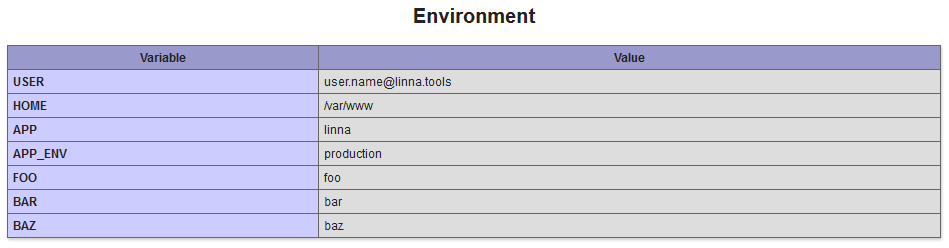

<div align="center">
    <a href="#"></a>
</div>

<br/>

<div align="center">
    <a href="#"></a>
</div>

<br/>

<div align="center">
    
[](https://travis-ci.org/linna/dotenv)
[](https://scrutinizer-ci.com/g/linna/dotenv/?branch=master)
[](https://scrutinizer-ci.com/g/linna/dotenv/?branch=master)
[](https://github.styleci.io/repos/145428565)

</div>

# About
This package provide a way to load .env files values as environement variable, it was insiperd by [nodejs counterpart](https://github.com/motdotla/dotenv).

## Requirements
This package require php 7.1

## Installation
With composer:
```
composer require linna/dotenv
```

## Usage
.env.test file as example
```
APP=linna
APP_ENV=production
USER=user.name@linna.tools
FOO=foo
BAR=bar
BAZ=baz
```

php code for get above values
```php
$env = new Linna\DotEnv\DotEnv();
$env->load('.env.test');

$app = $env->get('APP');
$app_env = $env->get('APP_ENV');

//string 'linna' (length=5)
var_dump($app);

//string 'production' (length=10)
var_dump($app_env);
```

environment information in phpinfo()
```php
phpinfo(INFO_ENVIRONMENT);
```



## Notes
DotEnv class use php function [getenv](http://php.net/manual/en/function.getenv.php) and [putenv](http://php.net/manual/en/function.putenv.php) then 
key and values will not be loaded in `$_ENV` superglobal.
